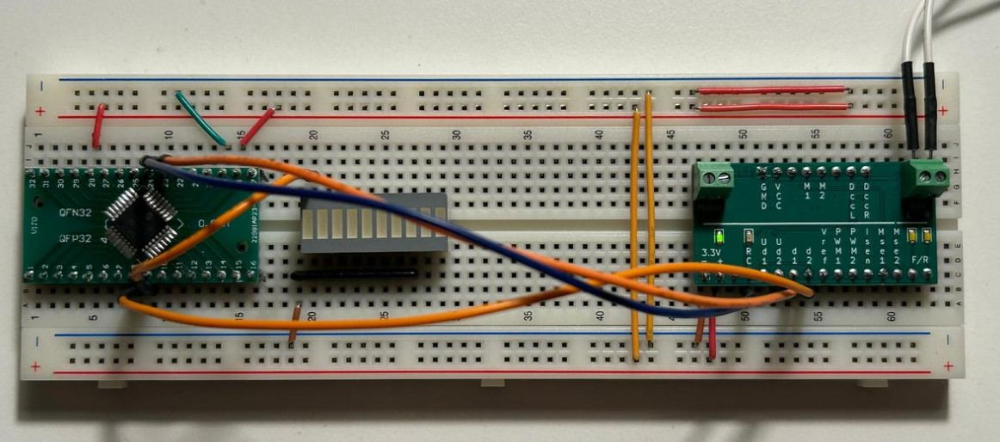
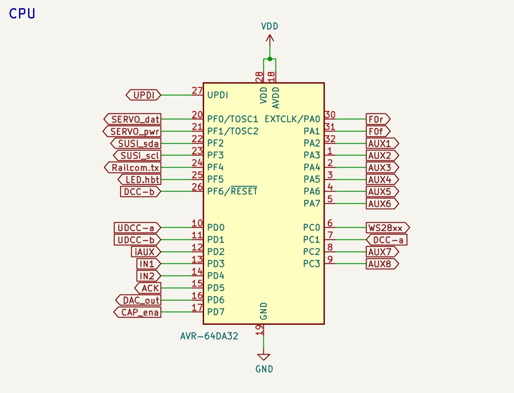
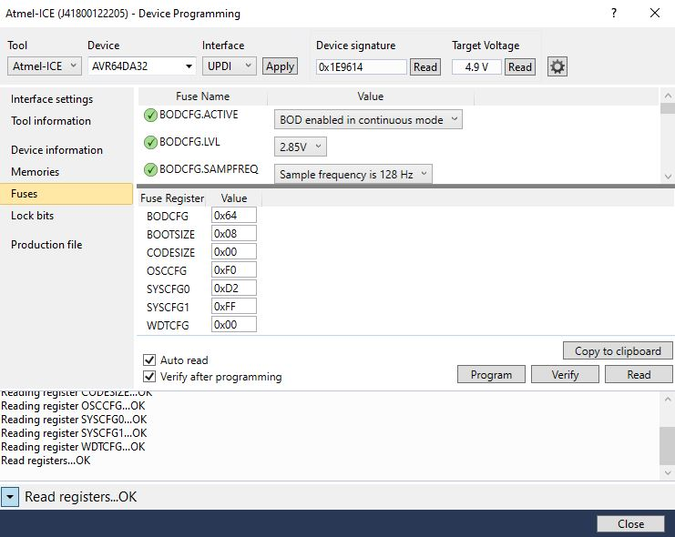
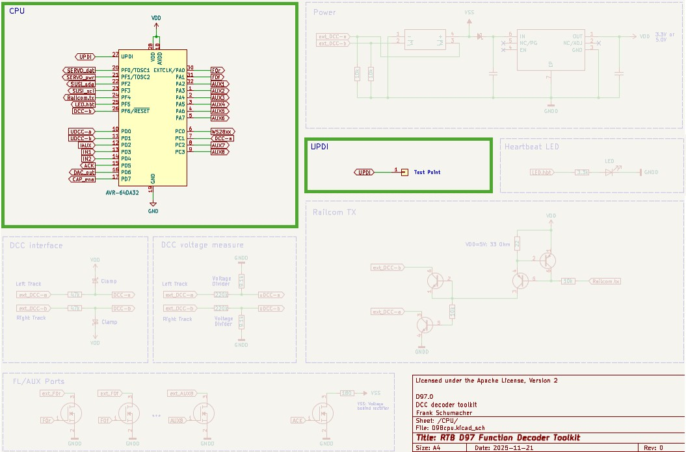
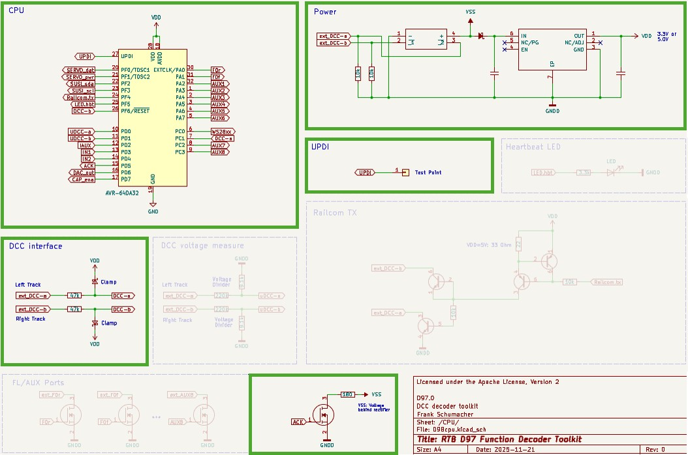
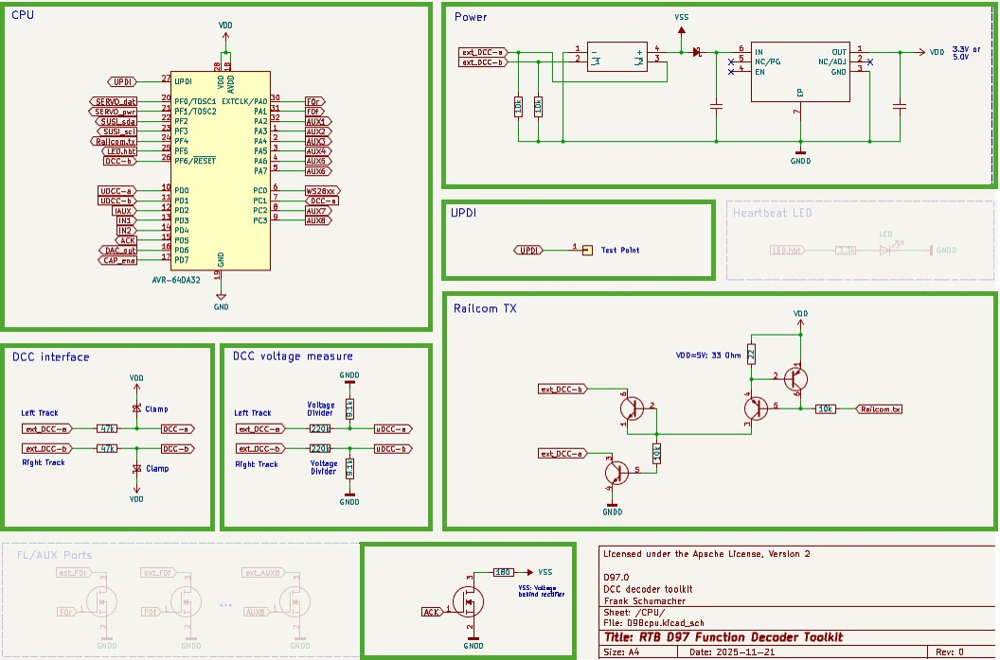
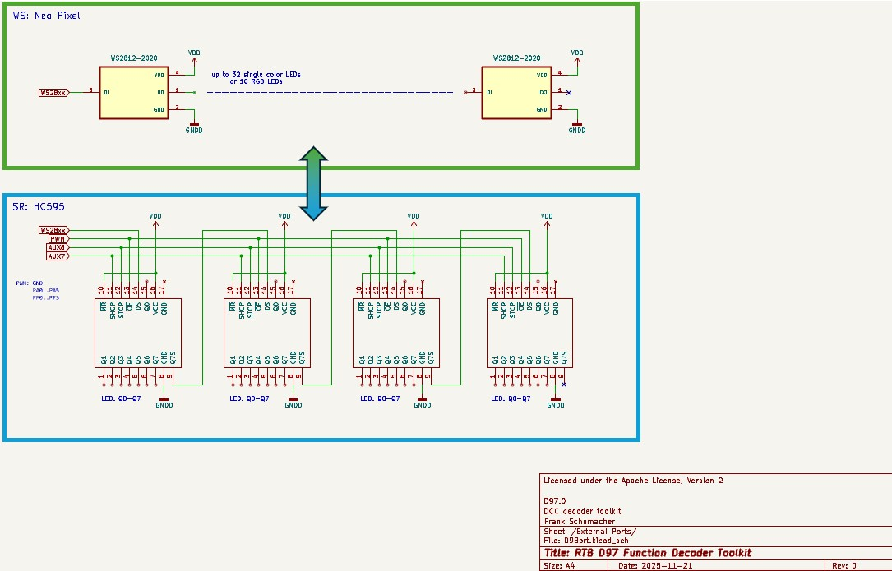
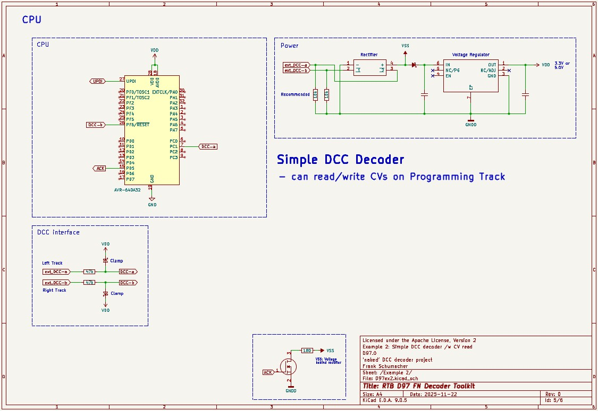
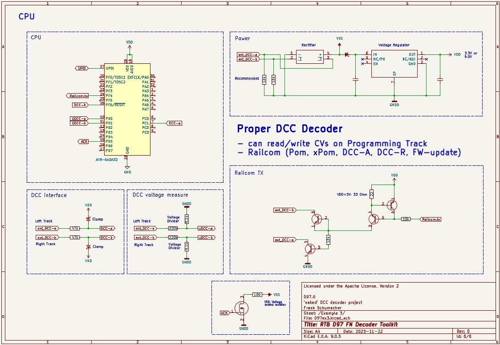
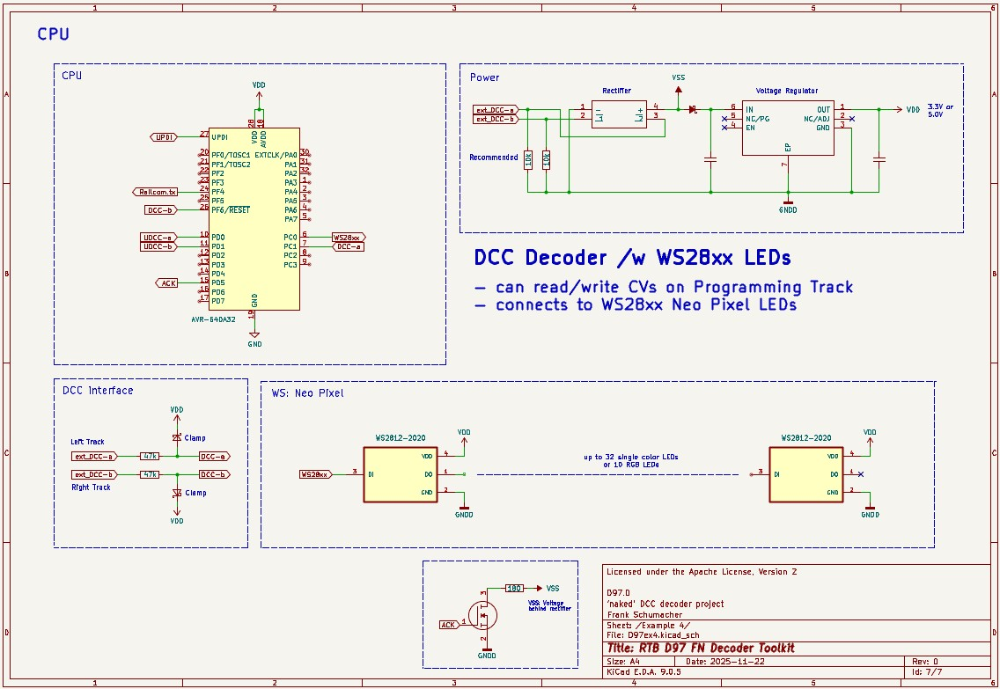

# RTB_D97

**Unleash your Homebrew DCC Function Decoder projects!**  
This repository provides a high-performance, **compiled firmware** tailored for the Microchip AVR64DA32 (see the pinout below!). I provide the digital brain — the rest is up to you. While essential support circuitry (power, dividers, level shifters) is required, this design choice is intentionally open, **inviting you** to innovate and customize your ultimate DCC decoder hardware. Scroll down for starter schematics and explore my other repos for more circuit ideas!

:star2: This decoder offers the distinctive capability of controlling up to **32 WS2811 NeoPixel LEDs**, facilitating simple LED wiring.

**User Guides**

- [User Guide - DE](https://rtb4dcc.de/rtb_fndecoder_Reference_de/)
- [User Guide - EN](https://rtb4dcc.de/rtb_fndecoder_Reference_en/)

The setup shows the CPU interfaced with the DCC signal (orange wires), a Raicom transmitter (dark blue wire), and a wire to a heartbeat LED. Standard power (VDD/GND) lines are also there. The PCB located on the right holds all the necessary support electronics, including the power supply management and voltage level shifters. The detailed schematic for this board is available in the [RTB_P26 GitHub repository](https://github.com/git4dcc/RTB_P26).
  

## Decoder firmware features
- **DCC**
  - DCC-A support (incl. Preamble fingerprint)
  - DCC-R support (DCC extension)
  - Service Mode Programming (Programming track)
  - Support of 'long 0000' programming address
- **Railcom**
  - Channel 1/2
  - jitter free
  - programmable TSS1, TSS2 timing
  - POM, xPOM
  - DYN: QoS, Track-Voltage, Temperatur and more
- **I/O ports**
  - 10 AUX ports total (6 ports with 93kHz hardware PWM)
  - 32 LED ports
    - either (SR: 74HC595) or (WS: WS2811/WS2812) mode
  - One 10-bit analog output port (0-5V)
  - Two 12-bit analog input ports (0-5V)
  - SUSI port (5V)
  - Servo port
- **Automation**
  - light emulation (bulb, neon, mars, ditch, ...)
  - Port automation (head-/taillight, engine room, driver cabin, ...)
- **General**
  - buffer capacitor control
  - CPU heartbeat LED for status information
  - fast firmware update on main tracks via DCC-R
- **DCC protocol statistic reporting**
  - DCC bit timing
  - DCC frame rate

# Hardware
The program is compiled for the AVR64DA32 microcontroller, which features standard logic-level digital I/O and analog I/O limited to a VDD swing. Therefore, external voltage level translators/drivers are required to allow the device to correctly decode and drive DCC signals.

| pin | label | direction | description |
| --- | --- | --- | --- |
| PA0 | F0r | output | Front light (rear) (/w hardware pwm) |
| PA1 | F0f | output | Front light (front) (/w hardware pwm) |
| PA2 | AUX1 | output | Auxiliary port 1 (/w hardware pwm) |
| PA3 | AUX2 | output | Auxiliary port 2 (/w hardware pwm) |
| PA4 | AUX3 | output | Auxiliary port 3 (/w hardware pwm) |
| PA5 | AUX4 | output | Auxiliary port 4 (/w hardware pwm) |
| PA6 | AUX5 | output | Auxiliary port 5 |
| PA7 | AUX6 | output | Auxiliary port 6 |
| PC0 | WS28xx | output | WS: DO / SR: data |
| PC1 | DCC-a | input | DCC input (left track) |
| PC2 | AUX7 | output | Auxiliary port 7 / SR: SHCP |
| PC3 | AUX8 | output | Auxiliary port 8 / SR: STCP |
| PD0 | uDCC-a | input | analog track voltage measure (left track) |
| PD1 | uDCC-b | input | analog track voltage measure (right track) |
| PD2 | iAUX | input | analog AUX current measure |
| PD3 | IN1 | input | analog input 1 |
| PD4 | IN2 | input | analog input 2 |
| PD5 | ACK | output | Service mode ACK current generator pin |
| PD6 | DAC_out | output | Analog output voltage |
| PD7 | CAP_ena | output | Buffer capacity control |
| PF0 | Servo_dat | output | Servo data |
| PF1 | Servo_pwr | output | Servo power control |
| PF2 | SUSI_sda | output | SUSI data |
| PF3 | SUSI_scl | output | SUSI clock |
| PF4 | Railcom | output | Railcom transmitter |
| PF5 | LED.hbt | output | Hearbeat LED |
| PF6 | DCC-b | input | DCC input (right track) |
| UPDI | UPDI | in/out | Programming pin |

## Kicad

  
 
This GitHub repository contains only the schematic. A PCB layout is not included, as the physical board design is intended to be customized and completed by each user.
  

[Schematic](doc/D97_schematic.pdf)

## Firmware

 
Initial firmware load must be done by using a UPDI programmer. Subsequent software updates can be done by using the RTB layout control infrastructure.
  
  
Filename structure: { **pcb** }{ **code** }{ **version** }.hex

Example: **D97F0001**.hex

|   | Description |
| --- | --- |
| **pcb** | Name of matching hardware (**D97**) |
| **code** | Type of code contained (**R**=rom, **B**=bootloader, **F**=flash, **U**=bld update, **P**=UPDI factory code) |
| **version** | Release version (**####**) |

[Firmware files](firmware)

## UPDI / Fuses
The fuse settings as well as the P-code (D97Pxxxx.hex) has to be installed by using UPDI. 

| Fuses Setting |
| --- |
||

# Hardware building blocks
Below the supporting electronics that can be used to construct DCC decoders with various functions and capabilities. These examples are offered only as suggestions and are designed to be fully customizable to meet specific needs.

| CPU only | /w Service Mode | /w Railcom |
| --- | --- | --- |
|  |  |  |

| external LED ports |
| --- |
|  |
 

# Examples
Below some examples of different Decoder designs. Starting from very simple up to fully featured.
  
  
## Example 1
This represents the **most basic DCC decoder design**. It requires only a power source and the DCC voltage divider to operate. All functional ports, as previously described, are available at standard logic voltage levels.

## Example 2
This example builds upon Example 1 by adding the essential capability of reading Configuration Variables (CVs) on the programming track. All other specifications and requirements remain the same as in the first example.

## Example 3
This example extends Example 2 by integrating Railcom (Bi-Directional Communication) capability. This powerful addition enables several advanced functions, including Programming on the Main (PoM), DCC-A, DCC-R, and firmware updates directly via the main track. All basic specifications and requirements remain unchanged from Example 1.

## Example 4
Here a simple but powerful NeoPixel Decoder that commands up to 32 WS28xx LEDs. Whether you prefer the control of WS2811 driver chips or the simplicity of integrated RGB LEDs like the WS2812C, this decoder is your lighting maestro. To keep things efficient, I recommend opting for the low-current (5mA) versions of these chips. Why? Because if you crank up all those LEDs to full brightness simultaneously, your decoder would be drawing some serious current! Choose wisely to save power and prevent overloading your setup.

``Note: Here you must use VDD = 5V decoder voltage because most WS28xx chips only run reliably with 5V.``

# Images
Some pictures of my prototype(s)
| /w two WS2812 RGB leds | /w sixteen WS2811 leds |
| --- | --- |
|  |  |

# YouTube
Showcased here are various decoder projects utilizing this DCC decoder toolkit. The accompanying PCBs are generally custom-designed to address specific functional and physical demands.  
| Video: H0 Roco /w RGB leds |
| --- |
|  |

This project is intended for hobby use only and is distributed in accordance with the Apache License 2.0 agreement.
